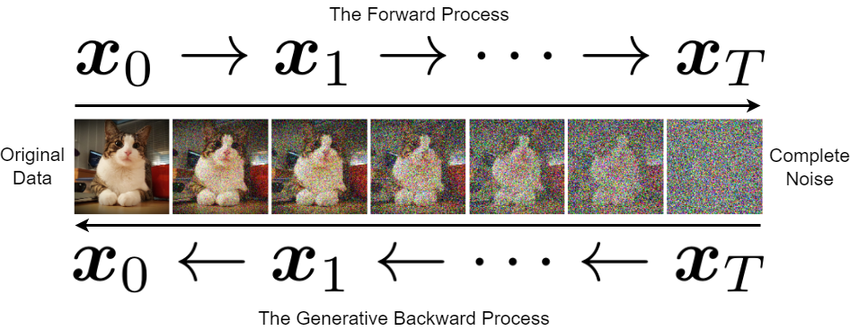

diffusion models are the current state of the art image genration models 

it consists of two processes 
- backward process 
- forward process 

in layman terms, the **forward process** adds noice in the original data and a neural network leanrs to denoise the image, that is the **backward process**

if want to see visualize it in our minds imagine there is a _image_ space of 1 million pixel, and the space is mostly empty, but in that space there are clusters of good images that mean something (like cats, dogs whatever) 

diffusion models learns to find its way from a random sample in the image space, to one of these clusters 

**diffusion maths cheatsheet (that is used while programming)** 

1. closed form noise sampling 

$$q(x_t|x_0) = N(x_t; \sqrt{\bar{\alpha}}x_0,(1-\sqrt{\bar{\alpha}})I)$$

where $\alpha_t$ = 1 - $\beta_t$ , $\bar{\alpha_t} = \prod_{s=1}^t\alpha_s$, $\beta$ is the noise

2. noise prediction loss 
$$L = E_{x_0, \epsilon, t} \left[ \| \epsilon - \epsilon_\theta(x_t, t) \|^2 \right]$$

3. sampling step ( ddpm )

$$x_{t-1} = \frac{1}{\sqrt{\alpha_t}} \left( x_t - \frac{\beta_t}{\sqrt{1 - \bar{\alpha}_t}} \epsilon_\theta(x_t, t) \right) + \sigma_t z$$

